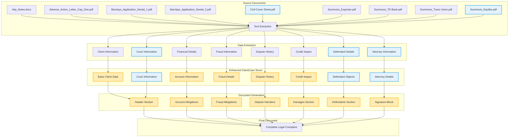

# Enhanced Document Data Flow Diagram

This diagram illustrates the enhanced data flow with the addition of the Civil Cover Sheet and Equifax summons. The blue nodes represent new components, while the yellow highlighted nodes show updated components that will incorporate the enhanced data.

## Key Improvements in Data Flow

1. **New Document Sources**: 
   - Civil Cover Sheet.pdf provides court information, case classification, and attorney details
   - Summons_Equifax.pdf adds another defendant with proper legal entity information

2. **Enhanced Data Extraction**:
   - Court Information extraction from Civil Cover Sheet
   - More detailed Defendant extraction from all summons documents
   - Attorney information extraction for proper document signing

3. **Structured Data Model**:
   - New Court Information section in ClientCase
   - Enhanced Attorney Details section
   - Structured Defendant objects instead of simple strings
   - Proper legal entity naming and addressing

4. **Improved Document Generation**:
   - More accurate court header section 
   - Complete and properly formatted defendants list 
   - Professional signature block with all required attorney information
   - Proper claim amount and filing details

The enhanced data flow creates a more comprehensive and accurate legal document that incorporates all available information from the source documents.
